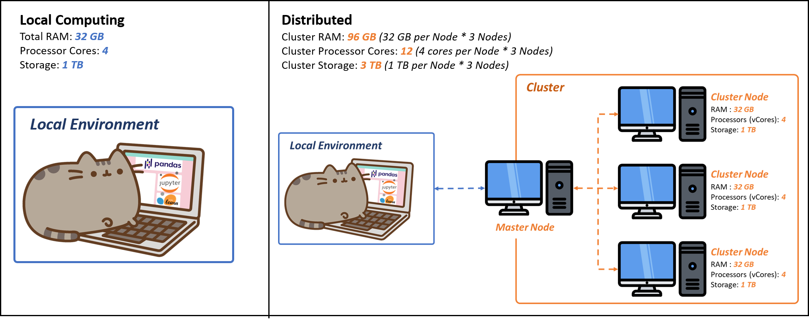
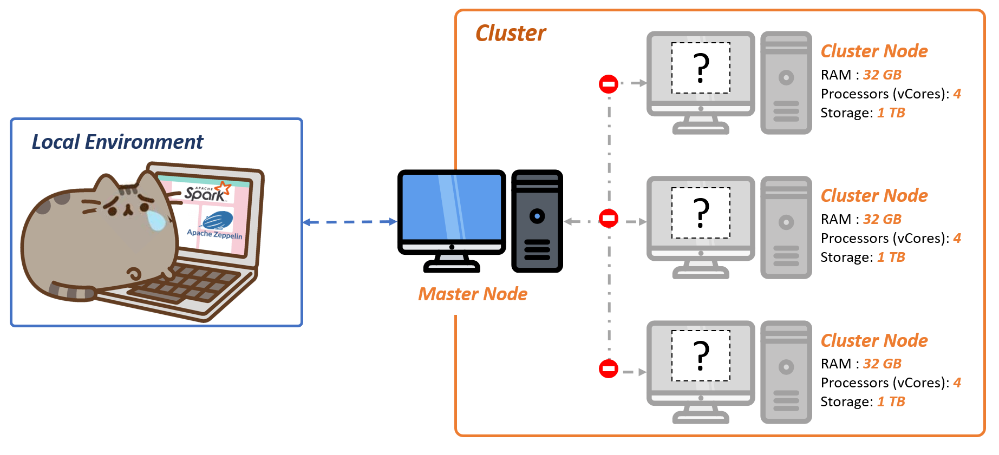
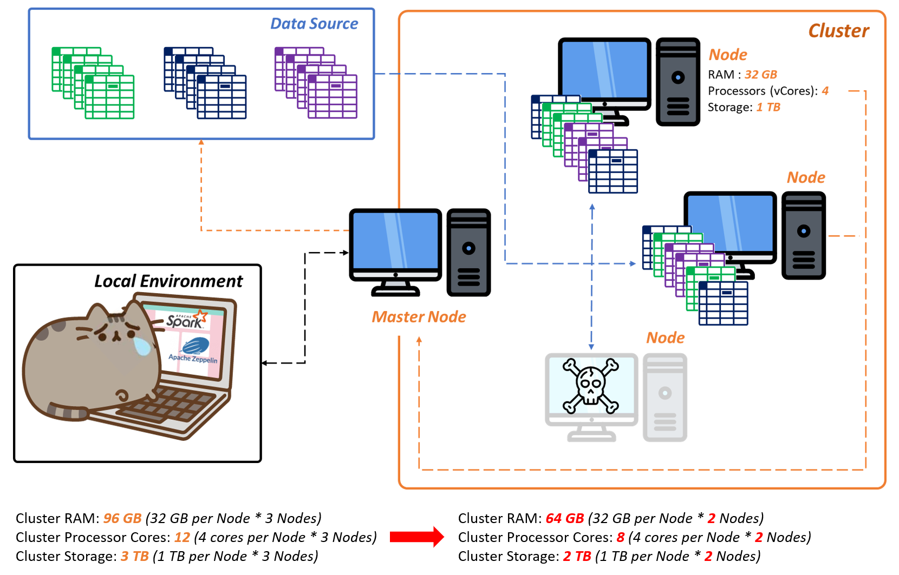
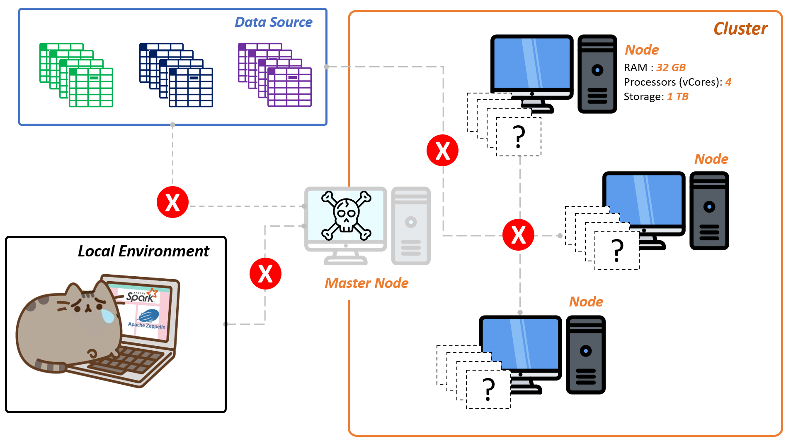

# A (Somewhat More) Practical Guide to Apache Spark - Part 1: Conceptual Introduction to Cluster Computing 

 In one of my first full-time roles as a data scientist, I was tasked with deploying and managing several Apache Spark pipelines that ingested, transformed, and cleaned terabytes of data for an enterprise analytics platform. 
 
 At the time, I had previously worked on a several academic projects using Spark, mainly through Databricks and AWS EMR. But, going into this project, my primary experience was working with the usual data science python libraries (Jupyter notebook, pandas, scikit, numpy, sci-py, Keras,Kaggle Notebooks, and JuptyerHub). As such, I was making the jump to cluster tools in a professional setting, for first time.
 
 
On my third day of the job, I reviewed the specifications for my new project, and I thought to myself: "....this should be an easy transition, right?"
 
 

  
 
 

At the surface level, there are a lot of similarites between Spark and the traditional DS tools that made the transition seem *somewhat* easy: 
- Pandas and Spark dataframes both provide intuitive, tabular representation for datasets (I happen to think that filtering and deduplications are actually *more* intuitive in Spark than Pandas, but more on that later)
- Both have one-line implementations for reading popular data formats (csv, parquet, json, txt)
- Both have similar UDF for implementations columnar transformations
- Scikit-learn and Spark MLlib are fairly similar in conceptual implementation (import-instantiate-fit-test-assess-repeat), though the code implementation differs slightly

However, a few more steps into the world of Spark revealed that there are <strong>many</strong> more considerations when implementing scalable, efficient Spark jobs. This was because I wasn't just changing from Python to Scala, or one coding framework to another, but because I was jumping from localized computing to the world of *cluster computing*.

 As such, although I had plenty of experience with DS tools and methods, I discovered a significant knowlege gap in areas of commoditiy hardware, memory management, and networks, that kept me from fully realizing Spark's potential.
 
 

 

  

In the following articles, I'll be addressing many of these knowledge gaps, covering key concepts and practical examples that will help any data scientist make the transition from the more traditional, localized data science tools to a cluster computing framework in Apache Spark.

Topics covered will include:

- A Conceptual Introduction to Cluster Computing (this article)
- Spark Internals and Core Spark Concepts (Master-Executor Framework, Partitions, Stages, and Jobs)
- Spark UI (SQL Plans, Executor/Job Metrics) 
- Spark Memory Management Basics 
- Cluster Sizing and Considerations
- Deploying Spark on AWS EMR 
- MLlib Optimizations
- Anything else I can think of that may be useful

 

## A Conceptual Introduction to Cluster Computing

This next section goes over a <strong>conceptual</strong> explanation of cluster computing, as opposed to local/single threaded computing. This serves to establish a mental framework to carry forward, into the next few Spark-specific articles. As such, this will be an *abstract* description of cluster processes and not specific to Apache Spark.

If you want to jump right into Spark, please continue to the [next article](link_to_Part_I_article)
 
 

### From Localized to Cluster Computing

Conceptually, the rationale for moving from localized to cluster computing is pretty simple: 

- Single computers (or *machines* going forward) have limited amounts of memory, computing power, and storage. So if you want to process an amount of data that is significantly greater than your memory and storage capabilties, your machine will struggle (and likely fail)
- Instead of using a single machine, we can utilize multiple machines (or a *cluster*) to read and divide our data load into chunks. Each machine then performs the necessary operations on those chunks, and returns the results to us, through a cluster gateway (also referred to as the *Master Node* - more on this later)
- Using the method above, we can harness the combined memory, computing, and storage of all the machines in the cluster (we'll call the individual machines in a cluster *nodes* going forward). 
- In addition, we're also *distributing* the computing work on this data across the cluster's nodes. This allows us to handle significantly larger data sizes and perform very complex tasks (that would otherwise crash a local machine).
 

On top of the additional computing power and memory, this also has several other key advantages:

- Cluster computing <strong>scales</strong> much more easily. That is, if you need more memory or computing power, you can add more machines to your cluster. This is opposed to a single machine, where you would need to add RAM to the device or upgrade the processor
- Many cluster processes implement parallelism, in which certain tasks are completed concurrently. This means that each node above can operate on its chunk of data independently of the other nodes, and then coalesce its results with the other nodes upon completion. This speeds up data processing significantly, especially for memory-intensive tasks

 
However, with more machines also comes more processes to manage them, and thus more places for errors. Below, I've categorized the errors into "buckets" (but it's worth noting that there are WAY more errors, than I have time or space to account for):
 
 

<strong>Network/Communication Errors</strong>: In which the nodes in your cluster lose communication with each other, with the data source, or with the master node (and therefore you)

 

<strong>Node Errors</strong>: Individual nodes can fail for a variety of reasons, but if enough nodes go down, your remaining cluster may not have the memory or compute necessary to complete the tasks at hand

 

<strong>Master and Driver Node Errors</strong>: Though we haven't touched on the Master and Driver nodes (part of the next article will be dedicated solely to them), there are crucial for securing and coordinating work among the cluster nodes. These nodes can also fail, which means the cluster will not be able to coordinate work or report progress back to us. This makes master and driver node failures the most detrimental to any cluster computing job

 
As we continue to work through code examples in the proceeding articles, we will encounter, explain, and address errors that fall into each of these categories (we'll attach formal names to these errors later, as well). The important takeaway here that working with a cluster of machines expands the potential areas for error *significantly,* so to be wary of that when troubleshooting your Spark programs going forward

 
 

## Moving Forward into Apache Spark, EMR, and YARN
With this framework in mind, we can now move into the realm of practicality. In the next article, we will break down the key players of a Spark cluster, and their roles in facilitating a Spark job.