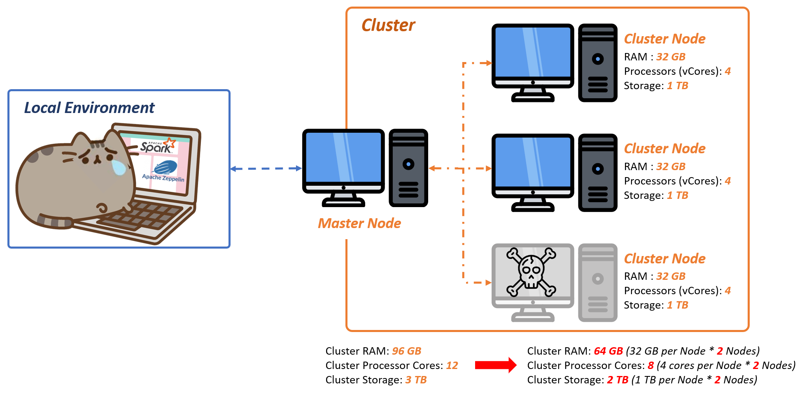

# A (Somewhat More) Practical Guide to Apache Spark - Part 1: Conceptual Introduction to Distributed Data Science 

 In one of my first full-time roles as a data scientist, I was tasked with deploying and managing several Apache Spark pipelines that ingested, transformed, and cleaned terabytes of data for an enterprise analytics platform. At the time, I had previously worked on several academic projects using Spark, but my primary experience was working with the usual data science python libraries (Jupyter notebook, pandas, scikit, numpy, sci-py, Keras, Kaggle Notebooks, JuptyerHub, etc.). As such, this was my first professional endeavor managing an Apache Spark program of this size. 
 
 
Upon receiving the specifications for my new task, I pulled up the Spark 3.0.0 documentation and thought to myself: "this should be an easy transition, right?"
 
 

  
 
 

Although there are a lot of similarities between the two, transitioning from Pandas/Python DS to Spark is more than just moving from Python to Scala, or moving from one coding framework to another. Rather, it's a transition from *localized* data science to *distributed* data science - a transition from data analysis on a single machine to a cluster of machines. 

This requires an understanding of several key technical concepts that are not generally covered in traditional pre- or post-grad data science programs. So, regardless of whether or not you studued data science in school, or at a post-grad program (like General Assembly, Udacity, or Metis), there's a good chance that you haven't had signficant exposure to these topics.

 

 

 

In the following articles, I'll be covering these topics and practical examples that will help any data scientist make the transition from localized data science tools to clustered/distributed data science with Apache Spark.

Topics covered will include:

- A Conceptual Introduction to Distributed Data Science (this article)
- Spark Internals and Core Spark Concepts (Master-Executor Framework, Partitions, Stages, and Jobs)
- Spark UI (SQL Plans, Executor/Job Metrics) 
- Spark Memory Management Basics 
- Cluster Sizing and Considerations
- Deploying Spark on AWS EMR 
- MLlib Optimizations
- Anything else I can think of that may be useful

 
 

## A Conceptual Introduction to Distributed Data Science

This next section goes over a <strong>conceptual</strong> explanation of distributed and cluster-based data science, as opposed to localized data science. This serves to establish a mental framework to carry forward, into the next few Spark-specific articles. As such, this will be an *abstract* description of cluster processes and not specific to Apache Spark.

If you want to jump right into Spark, please continue to the [next article](link_to_Part_I_article)
 
 

### From Localized to Distributed Data Science

Conceptually, the rationale for moving from localized to distributed data science is pretty simple: 

- Single computers (or *machines* going forward) have limited amounts of memory, computing power, and storage. So if you want to process an amount of data that is significantly greater than your memory and storage capabilties, your machine will struggle (and likely fail)
- Instead of using a single machine, we can utilize multiple machines (or a *cluster*) to read and divide our data into chunks. Each machine then performs the necessary operations on those chunks, aggregates the results, and returns those results to us (through a cluster gateway or *Master Node* - more on this later)
- Using the method above, we can harness the combined memory, computing, and storage of all the machines in the cluster. We'll call these individual machines in a cluster *nodes* going forward. 
- In addition, we're also *distributing* the computing work on this data across the cluster's nodes. This allows us to handle significantly larger data sizes and perform very complex tasks (that would otherwise crash a local machine).
 

On top of the additional computing power and memory, this also has several other key advantages:

- Distributed processes <strong>scale</strong> much more easily. That is, if you need more memory or computing power, you can add more machines to your cluster. This is opposed to a single machine, where you would need to add RAM to the device or upgrade the processor
- Many cluster processes implement parallelism, in which certain tasks are completed concurrently. This means that each node above can operate on its chunk of data independently of the other nodes, and then coalesce its results with the other nodes upon completion. This speeds up data processing significantly, especially for memory-intensive tasks

 
However, with more machines also comes more processes to manage them, and thus more places for errors. Below, I've categorized the errors into "buckets" (but it's worth noting that there are WAY more errors, than I have time or space to account for):
 
 

<strong>Network/Communication Errors</strong>: In which the nodes in your cluster lose communication with each other, with the data source, or with the master node (and therefore you)

 

<strong>Node Errors</strong>: Occur on individual machines, which cause them to fail. Individual nodes can fail for a variety of reasons, but if enough nodes go down, your remaining cluster may not have the memory or compute necessary to complete the tasks at hand

 

<strong>Master and Driver Node Errors</strong>: Though we haven't touched on the Master and Driver nodes (part of the next article will be dedicated solely to them), there are crucial for securing and coordinating work among the cluster nodes. These nodes can also fail, which means the cluster will not be able to coordinate work or report progress back to us. This makes master and driver node failures the most detrimental to any cluster computing job

 
As we continue to work through code examples in the proceeding articles, we will encounter, explain, and address errors that fall into each of these categories (we'll attach formal names to these errors later, as well). The important takeaway here that working with a cluster of machines expands the potential areas for error *significantly,* so to be wary of that when troubleshooting your Spark programs going forward

 
 

## Moving Forward into Apache Spark, EMR, and YARN
With this framework in mind, we can now move into the realm of practicality. In the next article, we will break down the key players of a Spark cluster, and their roles in facilitating a Spark job.
